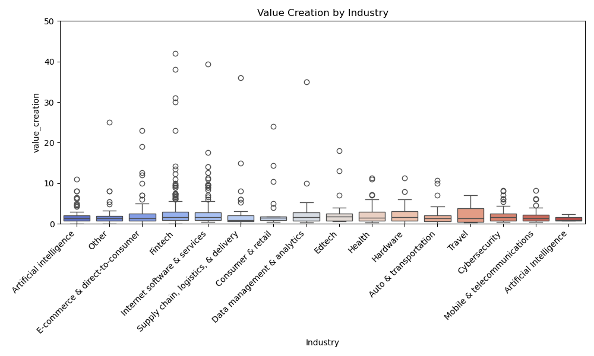

# INDIVIDUAL PROJECT 1 BY CHRIS MOREIRA

# PROJECT BADGES
FORMAT BADGE: 
INSTALL BADGE: 
LINT BADGE: 
TEST BADGE: 

# PROJECT DESCRIPTION
Requirements
- Python script using Polars for descriptive statistics
- Read a dataset (CSV or Excel)
- Generate summary statistics (mean, median, standard deviation)
- Create at least one data visualization

# Brief Description of Dataset

- Company: Company name

- Valuation: Company valuation in billions (B) of dollars

- Date Joined: The date in which the company reached $1 billion in valuation

- Industry: Company industry

- City: City the company was founded in

- Country: Country the company was founded in

- Continent: Continent the company was founded in

- Year Founded: Year the company was founded

- Funding: Total amount raised across all funding rounds in billions (B) or millions (M) of dollars

- Select Investors: Top 4 investing firms or individual investors (some have less than 4)

# Project Components
- Input: csv file 
- Output: working & tested function that produces the chart below & statistics pertinent to the variability of value creation in my dataset. linting data with ruff. producing 4 badges(linting, formatitng, installing, testing)

# Mathematics for Value Creation 

- Value Creation = Current Valuation of Unicorn Company - Funding Amount

- Both valuation and funding are computed in the USD currency 

# Box Plot Chart (Relationship between Value Creation & Industry)

Note that this computed the variability of value creation for each industry presented in our raw data. 

# Summary Statistics
Mean of Value Creation (in billions): 2.921073446327684
Median of Value Creation (in billions): 1.524
Standard Deviation of Value Creation (in billions): 8.133136697911187
=======
